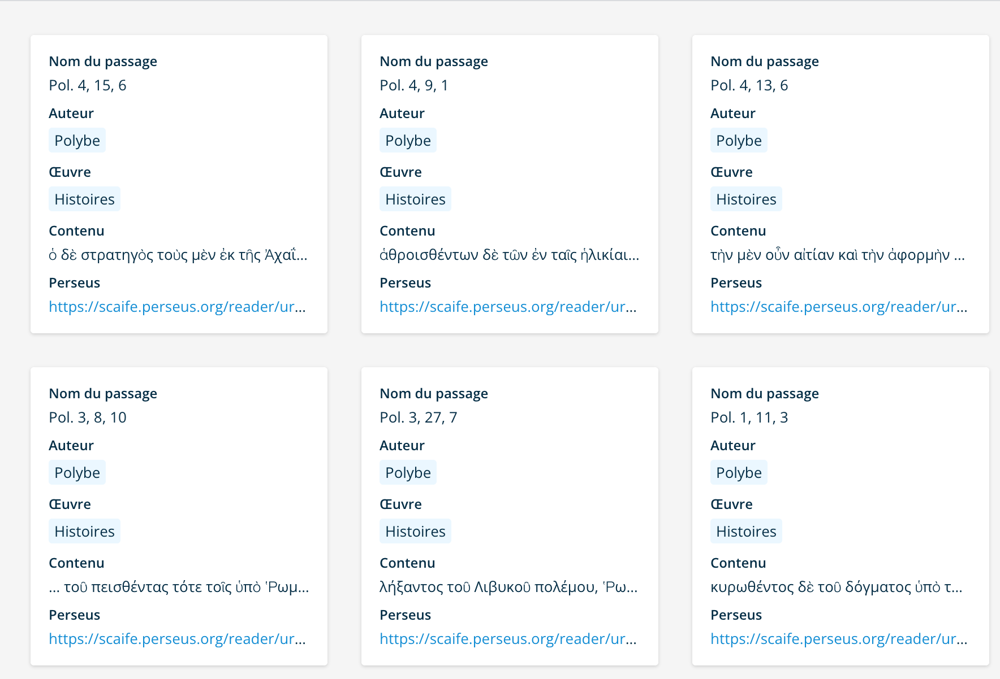
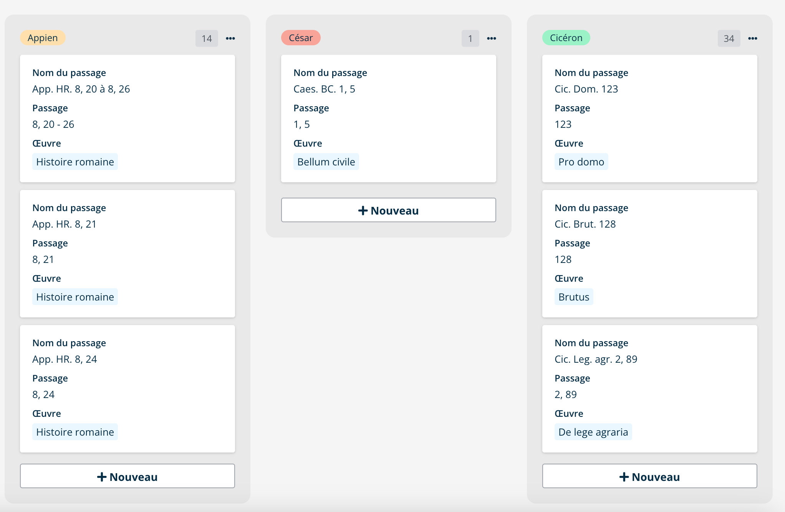
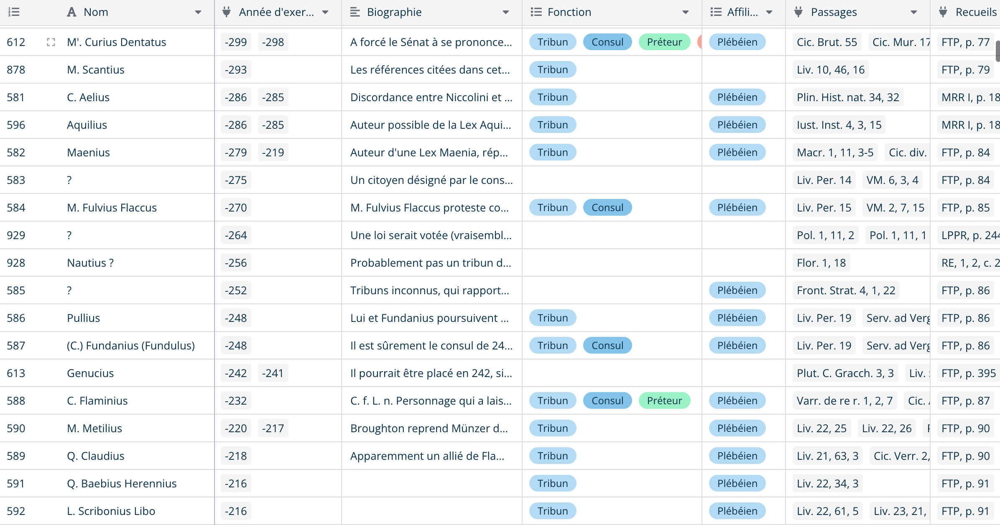
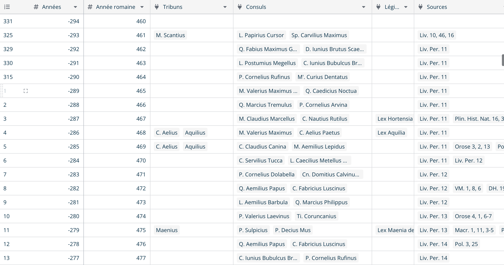

La base de données est encore assez mal comprise par beaucoup de chercheurs en sciences humaines. Si l'on comprend, pour la plupart d'entre nous, l'idée de s'affranchir de fiches, d'accélérer le travail et de faciliter la recherche, la prise en main de ces outils (encore très neufs pour nous) demeure problématique. Je me permets ici, sur l'invitation aimable d'Alexandre, le propriétaire de ce magnifique blog, de partager quelques *tips* qui faciliteront sans doute le travail du chercheur.

## Base de données, qu'est-ce à dire ?

Une base de données est un ou plusieurs jeux de données, classées non pas dans un certain ordre (il peut changer autant que vous le voudrez), mais selon une structure analogue. La structure est essentielle : sans elle, il n'y a pas de base de données. Une base peut comporter différents jeux de données, c'est-à-dire des groupes de données, selon la thématique que vous déciderez.
En tant que tel, ce jeu de données peut prendre la forme, par exemple, d'un tableur (dans un logiciel comme Excel, de loin le plus utilisé, ou Calc, Numbers…). Personnellement, j'ai néanmoins tendance à déconseiller cette forme, à moins que vous ayez des calculs à faire sur des jeux de données relativement petits. Les tableurs gèrent mal la quantité, ce qui est problématique lorsque l'on veut stocker beaucoup de données, mais gèrent très bien les opérations mathématiques [^1], ce qui peut s'avérer utile.
Aussi, je vous propose de passer à un logiciel de gestion de bases de données et, une fois que j'aurai fini d'expliquer ses avantages par rapport au tableur, je vous montrerai celui que j'utilise.

[^1]: Sachant que le logiciel de gestion de la base de données peut le faire aussi, mais il faut pour ce faire lui indiquer clairement qu'il nous faut une catégorie de données qui ne seront que des opérations.

## La base *vs* le tableur

La base de données, du moment qu'elle vous sert bien à stocker des données, est un logiciel très simple. Selon la base, plusieurs interfaces graphiques peuvent être proposées. Certains proposent de montrer les données sous forme de tableur, de liste ou de formulaire (que vous pouvez organiser vous-même, ce qui n'est pas sans s'avérer pratique).

Voici par exemple plusieurs captures d'écran du même jeu de données dans la même base mais organisé de façons différentes.

Vous aurez pu le constater, chaque présentation a ses avantages. Le jeu de données que j'ai choisi est mon jeu de passages. Je dois noter et enregistrer chaque passage qui me semble intéressant pour ma thèse, pour ensuite pouvoir le relier à des personnages ou à des événements importants : ils sont un peu ma matière première.

La première présentation de ces passages est plus attendue : elle offre une vue détaillée sur toutes les données du jeu dans des colonnes. Quand il y a beaucoup de "champs", c'est-à-dire de colonnes dans le tableur, plus le tableau devient illisible : c'est normal. C'est là qu'interviennent les autres présentations, qui permettent d'avoir une meilleure lisibilité et qui s'adaptent en fonction des besoins qu'on peut avoir.
Dans la deuxième, chaque "carte" correspond à une ligne du tableur, dont seulement certaines données sont sélectionnées. Cela permet d'avoir une vue d'ensemble sans être gêné par les données dont on estime ne pas avoir besoin sur le moment. La troisième montre quant à elle une sorte de perfectionnement de la précédente : chaque carte est regroupée selon un critère de classement (ici, les auteurs des passages).

Enfin, un logiciel de gestion de base de données offre généralement la possibilité de confectionner un formulaire, c'est-à-dire une interface permettant de saisir des données plus facilement (voire de permettre à d'autres personnes de les saisir).

Il n'y a qu'à saisir les données, cliquer sur "submit" et voilà ! Ça nous fait une ligne dans le tableau (un peu comme FramaForms [^2] vous me direz : eh oui, c'est la même chose !).

[^2]: Ou, *horresco referens*, Google Forms.

Mais il y a davantage… La base de données doit savoir quel type de données vous saisissez. Chaque champ doit donc être défini à l'avance (contrairement au tableur) pour que le logiciel sache bien traiter les informations. Une fois que cela est fait, il sait que les données de telle ou telle table sont des liens, d'autres du texte (plus ou moins long), d'autres encore une date, un nombre et même un fichier (eh oui : à votre avis il se passe quoi quand vous envoyez une photo sur Messenger à vos amis !? [^3]).

[^3]: Elle atterrit sur une base de données, au cas où vous n'aviez pas encore compris !

## Le logiciel que j'utilise

Il ne vous aura pas échappé sur la dernière capture d'écran qu'un petit logo apparaît tout en bas. C'est celui du logiciel que j'utilise : [Baserow](https://www.baserow.io/). S'il y en a bien un qui mérite un peu de publicité, il me semble que c'est lui car il est *open-source*, ce qui veut dire que tout le monde peut voir le code source, s'en inspirer, en faire une version pour soi (sous réserve d'avoir quelques connaissances pour ce faire) et, sinon, l'utiliser pour soi-même gratuitement (là encore, sous réserve de l'installer sur son propre ordinateur). Il y a même la possibilité de l'utiliser en ligne, avec certaines limites, il est vrai.

En constant développement [^4], ce logiciel offre tous les avantages d'un logiciel de gestion de base de données relationnelle. Si bien sûr il existe toutes les fonctionnalités standard qu'on attend d'un logiciel de gestion de base de données (différentes présentations des données, définition préalable du contenu des champs, possibilités de classement quasiment infinies…), j'aimerais vous en présenter quelques unes qui me servent particulièrement dans mon travail.

[^4]: Il y a une mise à jour tous les deux mois.

J'ai pour tâche de mettre en relation des informations avec d'autres, pour faire ce que l'on appelle une prosopographie, c'est-à-dire une liste de personnes regroupées selon un thème commun (pour ma part, le fait d'avoir exercé la charge de tribun de la plèbe dans l'Antiquité romaine [^5]). Pour ce faire, j'ai besoin, dès lors que je reporte un tribun connu dans ma base, d'avoir à portée de main la source de mes informations, c'est-à-dire où j'ai trouvé une référence à ce tribun, pour la mentionner dès que j'écris une notice. Une notice est un bloc de texte qui explique brièvement qui était cette personne, quel parcours il a eu avant, à quelle famille il appartient et ce qu'il a fait après. Si en plus il a exercé la charge de consul, de dictateur ou de grand pontife, je le reporte également.

[^5]: *cf* [Wikipédia pour plus d'informations](https://fr.wikipedia.org/wiki/Tribun_de_la_plèbe)

Mais voilà : avant l'existence des outils en ligne (et même de nos jours encore), faire une prosopographie supposait un travail titanesque. Il fallait faire, pour une seule personne, reporter des informations sur deux ou trois fiches différentes, selon le point d'accès qu'on souhaitait avoir. Si l'on souhaite avoir accès aux informations à travers le nom des tribuns, il faut faire des fiches classées par nom. Si l'on souhaite avoir accès à une liste ordonnée par date, il faut la faire à côté, si l'on souhaite également y avoir accès à travers la législation qui a été mise en place par des tribuns, c'est encore un nouvel ensemble de fiches qu'il faut faire.

Tous ces problèmes se résolvent avec la base de données relationnelle. Si l'on se propose de construire la base préalablement (dire au logiciel quelles informations doivent être reliées à d'autres), tout ce travail de copie peut être évité. Il suffit d'entrer l'information une seule fois.

## Démonstration

La première étape, comme je le disais, doit être la construction. C'est un peu contre-intuitif [^6], mais c'est la seule possible. Il est bien sûr possible de faire évoluer par la suite, mais on ne peut pas tout refaire étant donné que les données seront déjà rentrées selon le format choisi au préalable.

[^6]: et franchement opposé à la méthode de rédaction de thèse prônée par le propriétaire de ce blog, à laquelle j'adhère par ailleurs.

Pour ma part, après de longues semaines de réflexion, et après quelques ajouts (pas si marginaux que ça), voici la structure que j'ai choisie.

- Une base "tribuns" décomposée jeux de données :
	- Tribuns
	- *Gentes*
	- Années
	- Législation
	- Passages
	- Auteurs
	- Œuvres
	- Consuls
	- Censeurs
	- Dictateurs
	- Bibliographie
	- Recueils
	- Termes grecs (lexique)
	- Termes latins (lexique)

Vous pouvez constater que j'ai pas moins de quatorze jeux de données différents. Évidemment, je ne les ai pas définis tels quels *ab initio* : c'est le résultat de besoins que j'ai éprouvés en faisant mes recherches.

Si l'on prend le jeu "tribuns", on verra que peu de données lui sont réellement propres. Il y a le nom, le champ que j'ai intitulé "biographie", ses fonctions et ce que j'ai appelé "affiliation" qui comprend son appartenance à des groupes politiques (pour parler rapidement).

Le reste des données sont des "copies" faites par le logiciel, venant d'autres jeux. Si vous observez par exemple le champ "passages", y sont affichés les *loci* [^7]où j'ai trouvé des informations concernant ces tribuns. Bien sûr, je n'ai pas la prétention de dire que c'est moi qui les ai trouvés tout seul : bien d'autres l'ont fait avant moi et je n'ai fait que les recopier. Mais, si j'en trouve moi-même, ils y seront répertoriés.

[^7]: Pour les non-latinistes, il s'agit du nom latin pour parler de passages dans une œuvre.

J'attire également votre attention sur le champ "année d'exercice", qui est un connecteur vers le jeu "Années" : cela peut sembler superflu, mais la connexion de ce jeu avec un jeu spécifique pour les années me permet de recouper des informations précieuses : qui était consul en même temps, qui était censeur, qui était grand pontife, quel auteur mentionne des événements de la même année, à quelle année romaine cette année correspond-elle… ? Autant d'informations précieuses que je n'aurai pas à **faire** moi-même, puisqu'elles seront faites par la seule entrée d'informations dans l'une ou l'autre table.

Pour votre plaisir, voici un extrait de ma table "années".

J'espère donc que ce petit billet aura éveillé votre intérêt pour les bases de données relationnelles, et particulièrement celle de Baserow.

## Un peu de publicité

Pour finir, sachez que ce logiciel est librement accessible. Contrairement à des alternatives plus commerciales [^8], il y a un nombre de lignes que peut contenir une seule base, certes défini, mais important. Pour ma part, même ce nombre ne suffisait pas, ce qui m'a poussé à installer [Baserow](https://www.baserow.io/) directement sur mon ordinateur, comme s'il s'agissait d'un serveur. Cela fonctionne très bien.

[^8]: Comme Airtable.