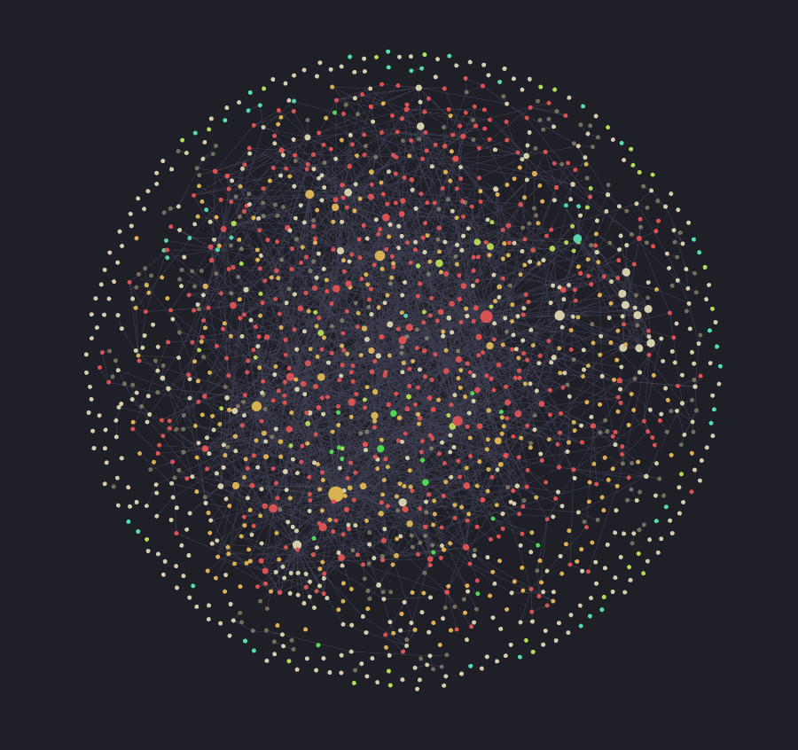
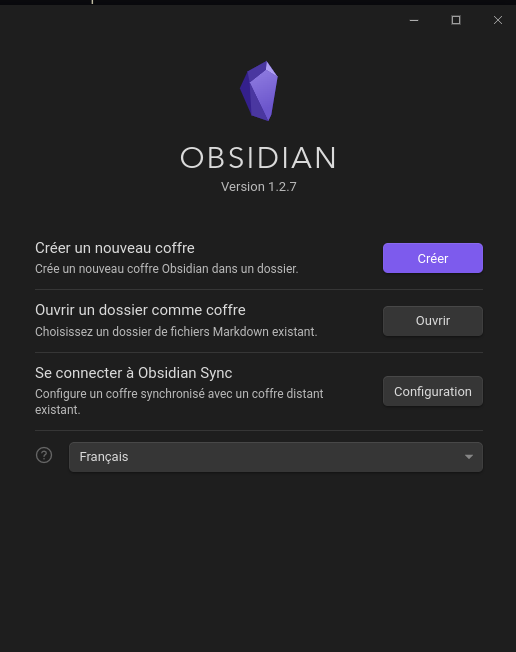
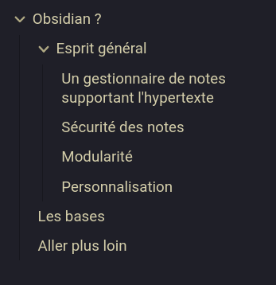

Ce billet a pour objectif de présenter un outil de gestion de connaissances *gratuit* et efficace : Obsidian. Je continue les réflexions commencées [ici](https://carnetdethese.github.io/posts/outils-info-2/). 

## Obsidian ?

[Obsidian](https://obsidian.md/) est un outil informatique de gestion de connaissances. Il appartient à une catégorie de programmes informatiques dont le but est d'organiser des notes et des fichiers divers. Parmi les programmes concurrents, on trouve :
- Evernote ;
- OneNote ;
- Notion ;
- LogSeq ;
- RoamResearch ;
- etc.

Lorsqu'on passe nos journées à lire et prendre des notes, un des problèmes les plus importants est celui de la *gestion des données*. Avec le temps, l'accumulation de notes variées contribue à une forme de chaos généralisé. C'est ce chaos que vise à réorganiser *Obsidian*.

### Esprit général

Obsidian est un gestionnaire de notes supportant l'hypertexte et favorisant la sécurité des notes, la modularité et la personnalisation.

#### Un gestionnaire de notes supportant l'hypertexte

Dans un espace unique dans lequel on peut naviguer, on retrouve toutes nos productions écrites, mais aussi les images, les PDF, etc. On notera deux caractéristiques notables : 

- **Centralisation** : le premier avantage d'utiliser un logiciel unique est la *centralisation* de son travail. Lorsque je commence une session de travail, la première chose que je fais est de démarrer *Obsidian*. Tout le travail de réflexion et d'écriture se passe donc au même endroit, évitant ainsi d'avoir à naviguer dans des dossiers perdus de mon ordinateur. 
- **L'inter-connectivité** : le deuxième avantage est l'utilisation de l'*hypertexte*. L'espace unique de travail devient un réseau de notes inter-connectées, que l'on peut naviguer à la manière de Wikipédia. Il me semble qu'il s'agit ici de la caractéristique la plus importante du logiciel.
	- *Obsidian* intègre par ailleurs différents outils permettant de travailler visuellement. L'un de ceux-ci est le *graphe*. Voilà à quoi ressemble le mien après 10 mois d'utilisation :

 
 
Chaque point représente une note ; plus le point est gros, plus il concentre de liens ; les couleurs correspondent à différents types de notes (fiches de lecture, fiches thématiques, etc.) ; les traits gris clair symbolisent les liens entre les notes. Concrètement, cette image représente mon travail de thèse.

#### Sécurité des notes

*Obsidian* fonctionne au-dessus d'un dossier appelé *Coffre*. Tous les fichiers visibles dans le logiciel sont les fichiers que l'on peut voir dans l'explorateur Windows / macOS / Linux. C'est ici un des autres avantages qu'offre le logiciel, et qui a motivé mon choix de choisir celui-ci sur un autre : on a le contrôle complet sur nos notes.

À l'inverse, un service comme *Evernote* contrôle l'accès des utilisateurs à leurs notes : tout se déroule en ligne, sur un serveur localisé dans un endroit inconnu. 

#### Modularité 

*Obsidian* excelle par sa modularité. Les développeurs ont fait le choix de concevoir un logiciel relativement basique, mais en laissant la possibililté à la communauté des utilisateurs de développer des *modules* (appelés *plugins*) permettant d'intégrer des fonctionnalités supplémentaires et de transformer l'expérience du logiciel.

L'un de mes modules préférés, et un des plus utilisés est *Dataview* (bientôt remplacé par *Datacore*) qui permet d'automatiser la création de tableaux avec les données contenues dans le *Coffre*.

#### Personnalisation 

Au-delà des modules, qui permettent de rendre l'expérience *Obsidian* très personnelle, il est possible de modifier l'apparence du programme et de développer son propre *processus de travail* (*workflow*). Chaque utilisateur ou utilisatrice d'*Obsidian* en a un usage personnel et différent des autres. Il n'y a pas une manière unique de l'utiliser.

Cette caractéristique peut déstabiliser au début. Lorsque j'ai commencé à l'utiliser, j'ai essayé de trouver *la* bonne manière de créer les liens, d'organiser les dossiers et les modules. Avec le temps, je me suis rendu compte que ce qui fonctionnait pour certains ne fonctionnait pas pour moi. C'est pourquoi je vous épargnerais des discussions interminables sur la *meilleure* manière de l'utiliser. Je vous conseille d'ailleurs de vous inspirer plutôt que d'appliquer minutieusement ce que d'autres ont fait. 

### Les bases

*Obsidian* vous permet de formater vos notes avec [Markdown](https://carnetdethese.github.io/posts/2023/02/mardown-simplicite/). Cela permet d'avoir un dossier très léger, facilement modifiable par d'autres programmes et qui demeure dans le temps (à ce jour, mon *coffre* contient env. 1500 notes pour un poids de moins de 300 Mo). 

Lorsque vous ouvrez le logiciel pour la première fois, la page suivante s'affiche :

En cliquant sur *Créer*, le programme vous accompagne dans la création d'un nouveau dossier qui accueillera vos notes. À compter de cette création, tous les fichiers que vous placerez dans ce dossier seront visibles dans le logiciel -- sous réserve d'un [format compatible](https://help.obsidian.md/Advanced+topics/Accepted+file+formats). 

Une fois dans votre *Coffre*, vous pouvez créer des fichiers et des dossiers, et les organiser dans le panneau de gauche. Dans le panneau de droite se trouvent des onglets pour visualiser les liens entrants et sortants, les différentes étiquettes (*tags*) que vous pouvez intégrer dans vos notes, ainsi que la structure de vos documents (qui se construit automatiquement grâce aux balises `#` de Markdown).

Pour cet article, le plan apparaît de cette manière dans le panneau de droite : 

Pour créer des liens, *Obsidian* supporte les *wikilinks*. Une fois que vous avez plusieurs notes créées, vous pouvez très facilement créer des liens entre elles de cette manière : `[[notes 1]]`. Une fois les liens créés, vous pouvez les visualiser dans le panneau de droite.

Le meilleur moyen de prendre en main le programme est d'essayer par soi-même les différentes fonctions disponibles. Je présenterai plus tard mon *workflow* ainsi que les plugins qui me sont le plus utiles.

## Aller plus loin

Il existe beaucoup de ressources en ligne pour découvrir le logiciel. Voilà quelques liens qui peuvent être utiles :
- https://help.obsidian.md/Home - la documentation officielle, très utile en cas de doute sur la manière dont le programme fonctionne et bon point de départ ;
- Les chaînes YouTube de Nick Milo ([Linking Your Thinking](https://www.youtube.com/@linkingyourthinking)) & de [Nicole van der Hoeven](https://www.youtube.com/@nicolevdh) ont d'excellentes vidéos sur le sujet ;
- https://www.eleanorkonik.com/resources/ - une liste de ressources pour découvrir le logiciel. L'autrice du blog (@Eleanor Konik) fait une veille chaque semaine sur les dernières actualités liées au programme avec une lettre d'actualité (Obsidian Roundup).

Il existe des ressources en français, mais ne les connaissant pas vraiment, je ne peux vous en conseiller une en particulier.

