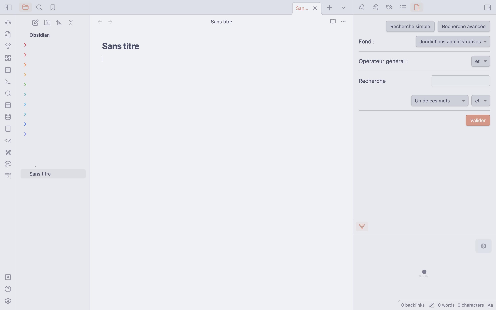
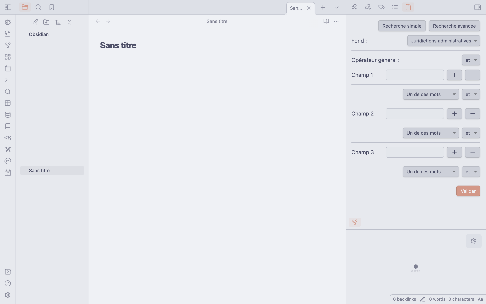
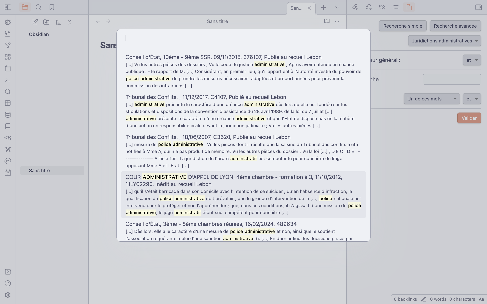
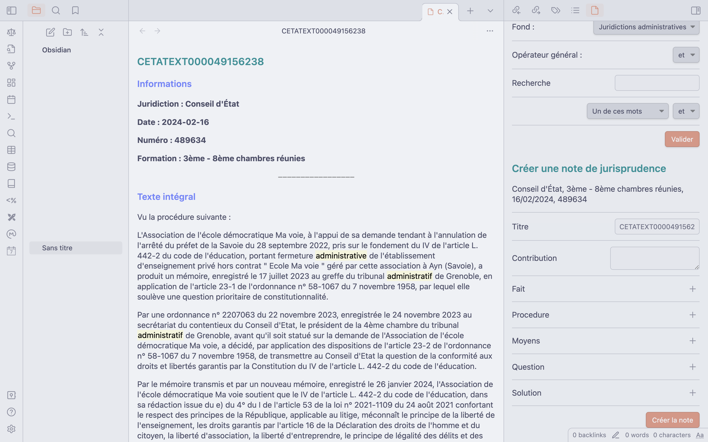
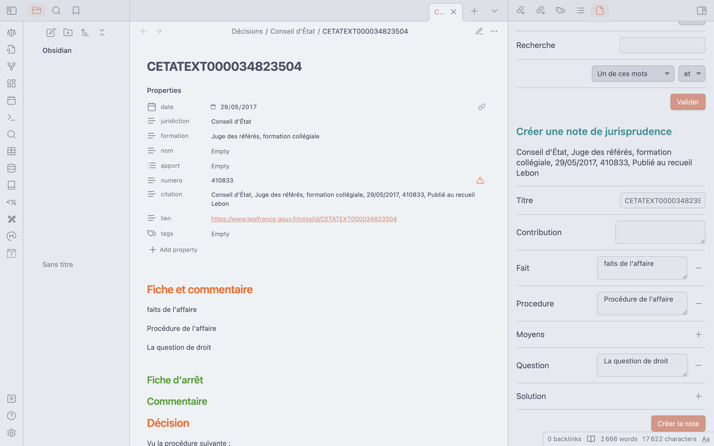

{}
**!! IMPORTANT !!**

UPDATE 27 mai 2024 : Le module a été approuvé par l'équipe d'Obsidian et intégré au Store interne du logiciel ! Vous pouvez dorénavant le retrouver directement sans passer par la méthode décrite ci-dessous.
{}

Depuis que j'ai découvert que Légifrance avait droit à son API, je n'avais qu'une idée en tête : intégrer Légifrance dans Obsidian. C'est maintenant chose faite, en partie, pour les décisions de justice !

Le module est en attente de validation par l'équipe d'Obsidian pour intégrer le _store_ interne de l'application. Mais vous pouvez d'ores et déjà le télécharger sur la [page GitHub du projet](https://github.com/carnetdethese/legifrance-integration/).

Pour cela, rendez-vous sur [cette page](https://github.com/carnetdethese/legifrance-integration/releases/tag/1.1.5) où vous pourrez télécharger les trois fichiers du module :

- main.js ;
- manifest.json ;
- styles.css.

Créez ensuite un dossier `legifrance-integration` dans le dossier `.obsidian/plugins/` de votre coffre Obsidian et ajoutez y les trois fichiers. Redémarrez le logiciel, et activez le module dans le panneau de configuration, et voilà !

La première utilisation vous demandera (un peu) de configuration pour obtenir des identifiants sur la [plateforme PISTE](https://piste.gouv.fr/). J'explique tout sur la page GitHub.

La dernière version du module intègre trois nouveaux éléments :

- Une fonctionnalité de recherche avancée, permettant des recherches plus complexes avec plus de termes ;
- Un panneau dédié à la manipulation des recherches et la création des notes de jurisprudence ;
- Des onglets dédiés à la lecture de la décision souhaitée.

## Quelques captures d'écran

### Panneau de recherche

Sur le côté droit, le panneau de recherche.

Recherche simple :

Recherche avancée :

### Affichage des résultats

Après avoir lancé la recherche, une fenêtre s'ouvre pour choisir la décision.

### Affichage de la décision

La décision s'affiche ensuite dans l'espace principal, avec les informations importantes. Le panneau de droite devient aussi un espace pour concevoir une fiche de jurisprudence. Il est possible d'ajouter ou de supprimer des champs, en fonction des besoins.

### Création de la fiche

Une fois la fiche créée, la décision est "incorporée" dans votre espace de travail sous la forme d'un fichier au format markdown, avec les informations que vous voulez.

Il est possible de changer le modèle suivant lequel la fiche est créée dans le panneau de configuration. Vous pouvez aussi chosir le nombre de résultats affichés, ainsi que le critère de tri.

## TODO

Le module est encore jeune et mériterait quelques ajouts. Voilà les quelques idées à développer :

- Laisser le choix du dossier dans lequel enregistrer les notes ;
- Support d'autres textes que des décisions de justice - notamment les actes législatifs et administratifs ;
- Ajouter un champ de recherche pour la date ;
- Présenter la liste de résultats de manière persistante sur le côté, pour éviter de relancer la recherche à chaque fois ;
- Rendre l'affichage des décisions persistant après redémarrage du logiciel.
